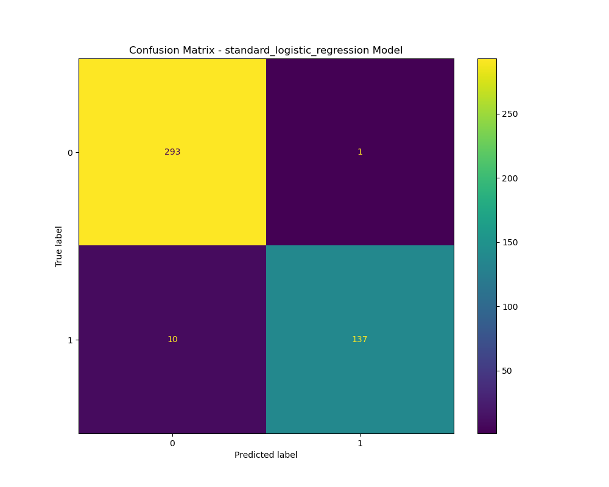
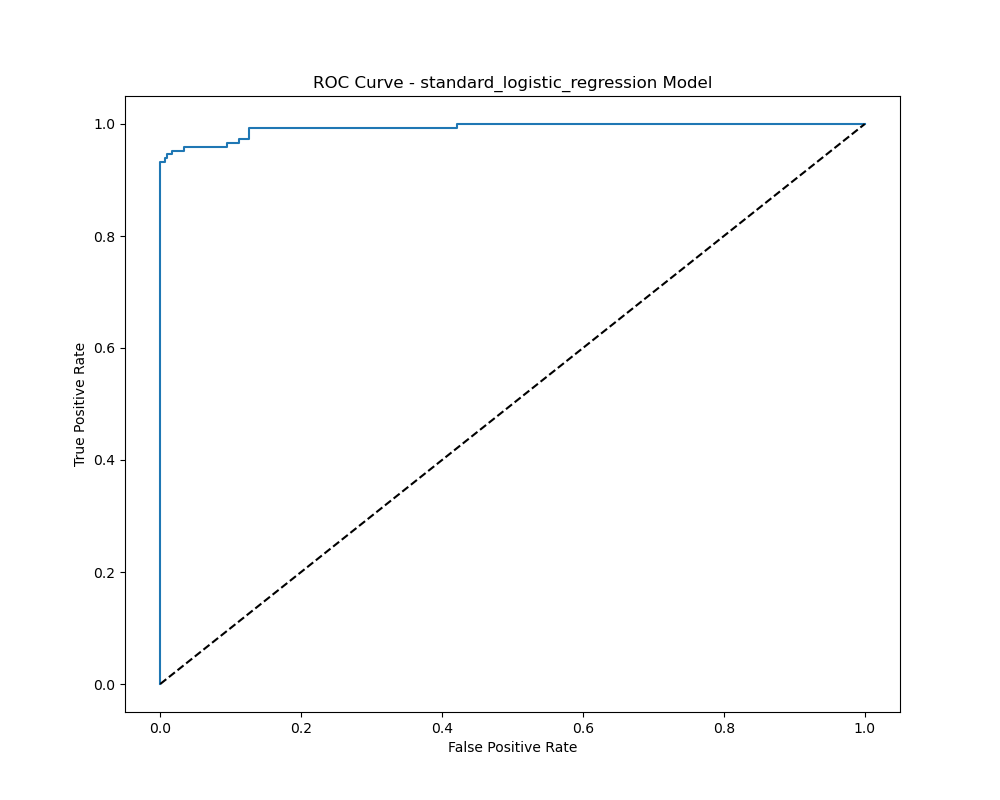
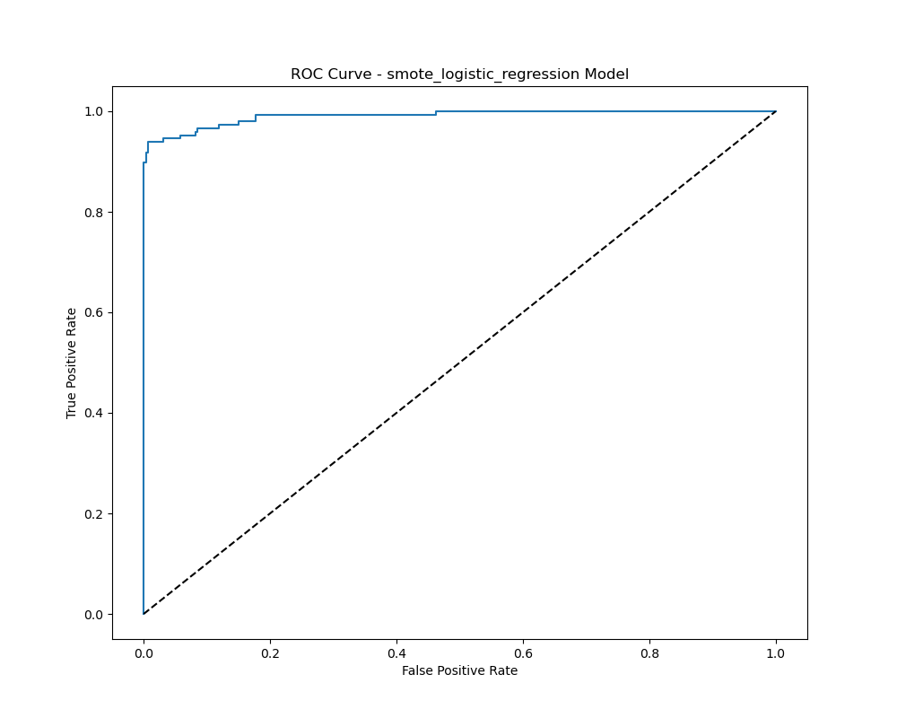
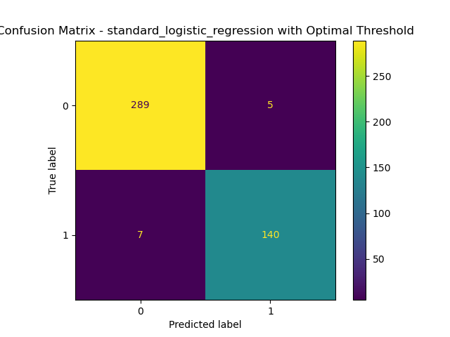
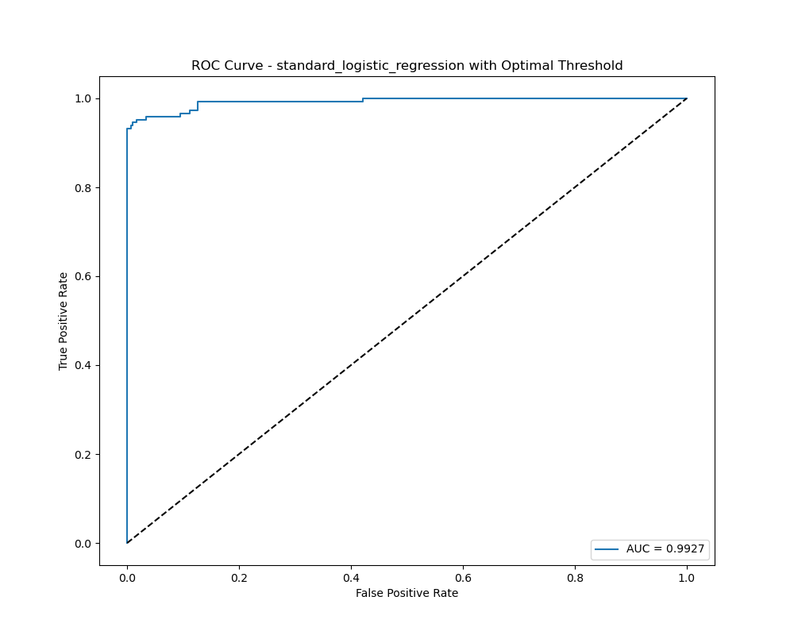
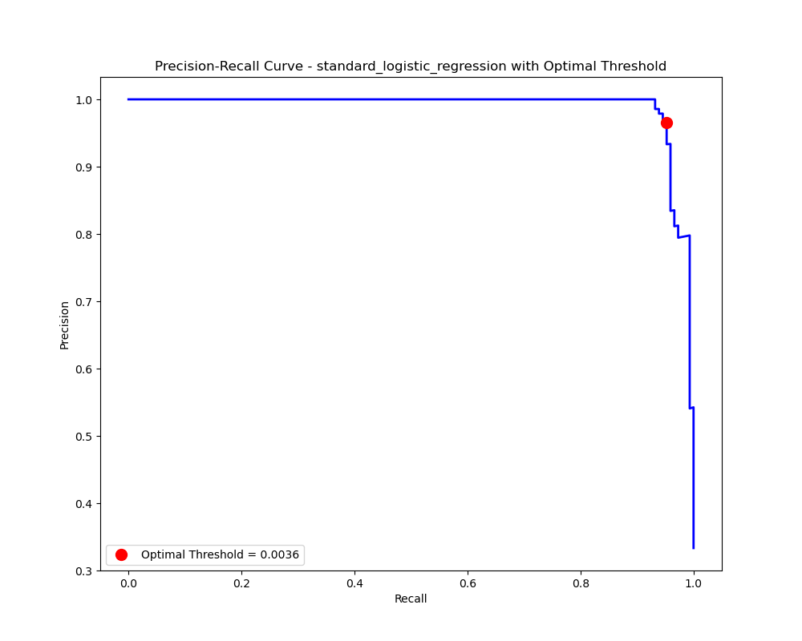
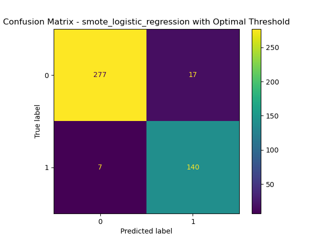
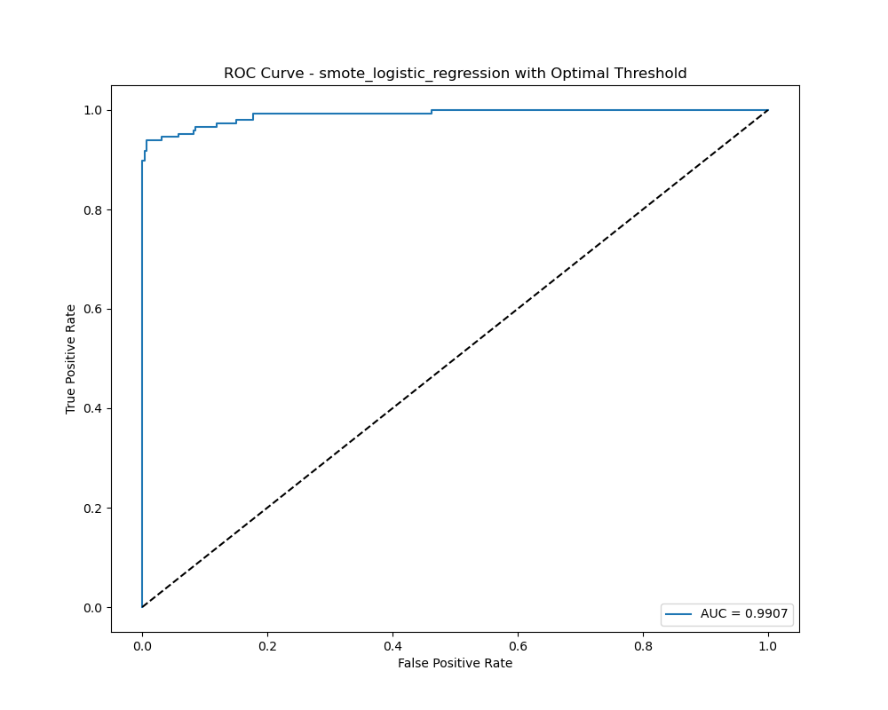
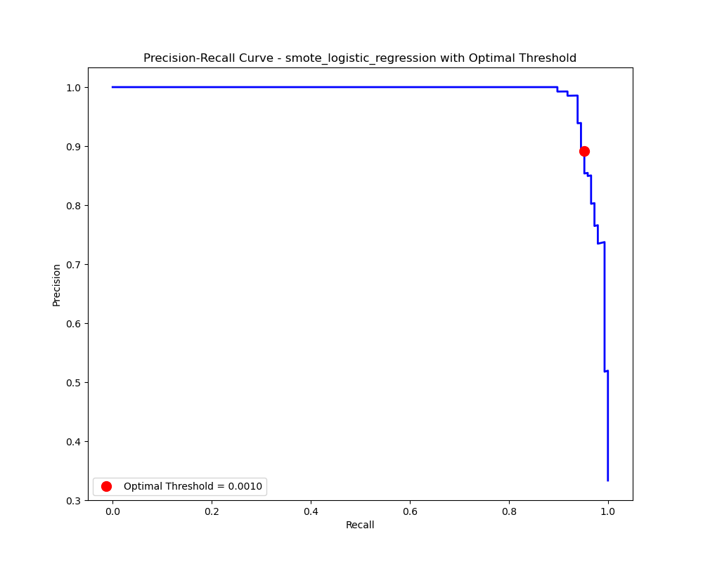

# Hydraulic Rig Dataset Analysis and Classification

## 📘 Dataset Overview

**Data Source:** [UCI Machine Learning Repository - Condition Monitoring of Hydraulic Systems](https://archive.ics.uci.edu/dataset/447/condition+monitoring+of+hydraulic+systems)

**Description:** This dataset is derived from a hydraulic test rig equipped with various sensors to monitor system performance under different conditions. The data includes measurements such as pressure, motor power, volume flow, temperature, vibration, cooling efficiency, cooling power, and efficiency factor. The primary objective is to classify the operational status of the hydraulic system using the 'stable flag' as the target variable.

### Key Features:

**Sensors Included:**
- Pressure (PS1-PS6)
- Motor Power 
- Volume Flow
- Temperature (TS1-TS4)
- Vibration (VS1)
- Cooling Efficiency (CE)
- Cooling Power (CP)
- Efficiency Factor (EPS1)

**Target Variable:** Stable Flag (Indicates whether the system is operational)

**Data Format:** Multivariate time-series data

**Instances:** 2,205

**Attributes:** 43,680 (comprising various sensor readings)

**Sampling Rate:** 1 Hz (for most sensors)

## 🔍 Data Processing Pipeline

### Data Preparation
1. **Feature Engineering:**
   - Loaded sensor data from pickle files (`sensor_data_df.pkl` and `profile_df.pkl`)
   - Combined sensor readings with target variable 
   - Split into training and testing sets with stratified sampling (80/20 split)
   
2. **Class Imbalance Handling:**
   - Applied SMOTE (Synthetic Minority Over-sampling Technique) to address class imbalance
   - Original distribution: {0: 1159, 1: 605}
   - After SMOTE: {0: 1159, 1: 1159}

3. **Time Series Feature Extraction:**
   - Implemented MiniRocketMultivariate transformation from the sktime library
   - Reshaped sensor data into 3D format (instances × channels × timepoints)
   - Applied MinMax scaling to normalized transformed features

## 🤖 Modeling Approaches

### Logistic Regression with Hyperparameter Tuning
1. **Baseline Model:**
   - Used RandomizedSearchCV to find optimal hyperparameters
   - Evaluated parameters: C, penalty, solver, max_iter, class_weight
   - Optimized for ROC AUC score with 5-fold cross-validation

2. **SMOTE-Enhanced Model:**
   - Applied the same modeling pipeline to SMOTE-balanced data
   - Compared performance metrics between baseline and SMOTE models

3. **Threshold Optimization:**
   - Modified decision threshold from default 0.5 to custom threshold for improved classification
   - Optimized threshold based on precision-recall curve analysis
   - Aimed for high recall (minimum 0.95) while maximizing F1 score

## 📊 Model Results and Evaluation

### Standard Logistic Regression Model

**Classification Report:**
```
Model: standard_logistic_regression
Accuracy: 0.9751

Classification Report:
              precision    recall  f1-score   support

           0       0.97      1.00      0.98       294
           1       0.99      0.93      0.96       147

    accuracy                           0.98       441
   macro avg       0.98      0.96      0.97       441
weighted avg       0.98      0.98      0.97       441

Confusion Matrix:
[[293   1]
 [ 10 137]]
```

**Confusion Matrix:**



**ROC Curve:**



### SMOTE-Enhanced Logistic Regression Model

**Classification Report:**
```
Model: smote_logistic_regression
Accuracy: 0.9728

Classification Report:
              precision    recall  f1-score   support

           0       0.97      0.99      0.98       294
           1       0.98      0.94      0.96       147

    accuracy                           0.97       441
   macro avg       0.97      0.96      0.97       441
weighted avg       0.97      0.97      0.97       441

Confusion Matrix:
[[291   3]
 [  9 138]]
```

**Confusion Matrix:**


**ROC Curve:**



### Threshold-Optimized Standard Model

**Classification Report:**
```
Model: standard_logistic_regression with Optimal Threshold
Accuracy: 0.9728

Classification Report:
              precision    recall  f1-score   support

           0       0.98      0.98      0.98       294
           1       0.97      0.95      0.96       147

    accuracy                           0.97       441
   macro avg       0.97      0.97      0.97       441
weighted avg       0.97      0.97      0.97       441

Confusion Matrix:
[[289   5]
 [  7 140]]
```

**Confusion Matrix:**



**ROC Curve:**



**Precision-Recall Curve with Optimal Threshold:**



### Threshold-Optimized SMOTE Model

**Confusion Matrix:**



**ROC Curve:**



**Precision-Recall Curve with Optimal Threshold:**



## 💡 Key Findings and Observations

1. **Model Performance Comparison:**
   - Both standard and SMOTE-enhanced models achieved high accuracy (>97%)
   - SMOTE model showed improved recall for the minority class (Class 1)
   - Threshold optimization further improved recall with minimal impact on precision

2. **Threshold Tuning Benefits:**
   - Standard model: Increased recall from 0.93 to 0.95
   - SMOTE model: Achieved target recall of 0.95 while maintaining high precision
   - Resulted in more balanced performance metrics between classes

3. **Business Impact:**
   - Higher recall means fewer missed detections of hydraulic system issues
   - Precision-recall tradeoff was carefully managed to minimize false positives
   - Optimized threshold provides more reliable prediction of system faults

## 🧪 Intended Use

This project demonstrates approaches for:
- Developing machine learning models for fault detection and classification
- Evaluating predictive maintenance algorithms
- Conducting time-series analysis and feature extraction
- Handling class imbalance in industrial datasets
- Threshold tuning for optimized classification performance

## 📄 License

This dataset is licensed under a Creative Commons Attribution 4.0 International (CC BY 4.0) license.
